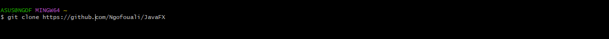
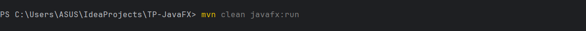
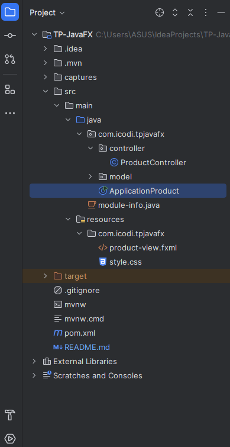

<h1>Application de Gestion de Produits en JavaFX</h1>
<h3>
Ce projet est une application de bureau simple développée en JavaFX pour gérer une liste de produits. Elle permet d'ajouter des produits avec un nom et un prix, et de les visualiser dans une liste. Ce projet illustre les concepts de base de JavaFX, notamment l'utilisation de FXML pour l'interface, les contrôleurs pour la logique, et le CSS pour le style.
</h3>
<h2>📸 Aperçu</h2>

 
<h2>✨ Fonctionnalités</h2>
<ul>
<li><strong>Ajout de produits :</strong> Un formulaire simple pour ajouter un nouveau produit avec son nom et son prix.</li>
<li><strong>Visualisation de la liste :</strong> Tous les produits ajoutés sont affichés dans une ListView.</li>
<li><strong>Validation des entrées :</strong> Vérification simple pour s'assurer que les champs ne sont pas vides et que le prix est un nombre valide.</li>
<li><strong>Interface utilisateur propre :</strong> L'interface est définie dans un fichier FXML et stylisée avec une feuille de style CSS externe.</li>

<li>
<strong>Modèle MVC simplifié </strong>: Le code est structuré en
<ul>
<li><strong>Modèle (Product.java) </strong>: La classe de données.</li>
<li><strong>Vue (product-view.fxml)</strong>: La définition de l'interface.</li>
<li><strong>(ProductController.java)</strong> : La logique de l'application.</li>
</ul>
</li>
</ul>
 
<h2>🛠️ Technologies et Outils</h2>
<ul>
<li><strong>Langage</strong> : Java 11 (ou supérieur)</li>
<li><strong>Framework UI</strong> : JavaFX 17 (ou supérieur)</li>
<li><strong>Build Tool / Dépendances </strong>: Apache Maven</li>
<li><strong>Interface</strong> : FXML</li>
<li><strong>Style</strong> : CSS</li>
</ul>
 
<h2>📋 Prérequis</h2>
Avant de commencer, assurez-vous d'avoir installé les éléments suivants sur votre machine :
<ul>
<li></li>
<li>JDK (Java Development Kit) - Version 11 ou supérieure.</li>
<li>Apache Maven - Pour gérer les dépendances et le build du projet.</li>
<li>Git - Pour cloner le dépôt.</li>
</ul>
 

<h2>🚀 Installation et Exécution</h2>

Suivez ces étapes pour faire fonctionner le projet localement.

<ol>
<li><strong>Cloner le dépôt</strong></li>

Ouvrez votre terminal ou Git Bash et exécutez la commande suivante :

 

<li><strong>Lancer l'application avec Maven</strong</li>

Dans le terminal, à la racine du projet, exécutez :

<li><strong>Lancer depuis un IDE (IntelliJ IDEA / Eclipse)</strong></li>
 
<ul>
<li>Ouvrez votre IDE</li>
<li>Sélectionnez File > Open... (ou Import Project...) et choisissez le répertoire du projet cloné.</li>
<li>L'IDE détectera le fichier pom.xml et importera le projet comme un projet Maven. Il téléchargera les dépendances nécessaires.</li>
<li>Naviguez jusqu'au fichier src/main/java/com/icodi/tpjavafx/ApplicationProduct.java.</li>
<li>Faites un clic droit sur le fichier et sélectionnez Run 'ApplicationProduct.main()'.</li>
</ul>
</ol>
<h2>📂 Structure du Projet</h2>

Le projet est organisé comme suit :

